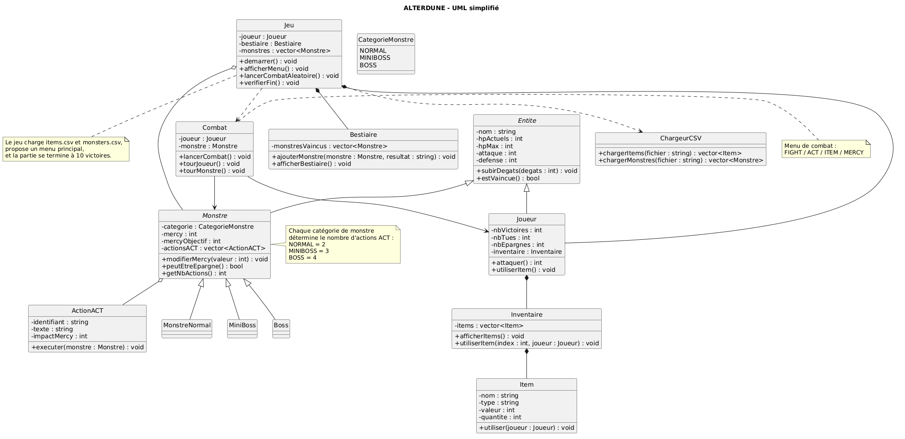

# ALTERDUNE (C++17)

ALTERDUNE est un mini-RPG console inspiré d'Undertale, conçu pour pratiquer la POO avec une architecture simple et défendable en soutenance.

## Compilation
```bash
g++ -std=c++17 *.cpp -o alterdune
```

## Exécution
```bash
./alterdune
```

## Fichiers de données
### items.csv
Format : `nom;type;valeur;quantite`
- `type` est limité à `HEAL`.
- `valeur` = nombre de HP soignés.
- `quantite` = stock initial.

### monsters.csv
Format : `categorie;nom;hp;atk;def;mercyGoal;act1;act2;act3;act4`
- Catégories : `NORMAL`, `MINIBOSS`, `BOSS`.
- ACT autorisées selon catégorie :
  - NORMAL = 2
  - MINIBOSS = 3
  - BOSS = 4
- Les identifiants ACT doivent exister dans le catalogue C++.

## Architecture POO (simple)
- `Character` : base commune (nom, HP, ATK, DEF).
- `Player` : joueur, inventaire, statistiques.
- `Monster` (abstraite) : Mercy, ACT, interface polymorphe.
- `NormalMonster` / `MiniBossMonster` / `BossMonster` : 2/3/4 ACT.
- `Game` : menu principal et coordination globale.
- `CsvLoader` : lecture + validation des CSV.
- `CombatManager` : combat tour par tour.
- `ActCatalog` : catalogue ACT (texte + impact Mercy).
- `BestiaryEntry` : entrée du bestiaire.

## Notions POO utilisées
- Encapsulation
- Héritage
- Classe abstraite
- Polymorphisme
- Composition
- Lecture de fichiers

## UML


## Tableau de conformité au cahier des charges
| Exigence | Implémentation | Statut |
|---|---|---|
| Chargement obligatoire `items.csv` et `monsters.csv` | `Game::loadData` + `CsvLoader` | ✅ |
| Saisie du nom + résumé initial | `main.cpp` + `Game::printStartSummary` | ✅ |
| Menu principal (5 options) | `Game::run` | ✅ |
| Bestiaire (nom/catégorie/stats/résultat) | `Game::showBestiary` | ✅ |
| Stats joueur minimales | `Player::printStats` | ✅ |
| Items hors combat utilisables | `Game::showInventoryMenu` + `Player::useItem` | ✅ |
| Combat FIGHT/ACT/ITEM/MERCY | `CombatManager::runCombat` | ✅ |
| Dégâts aléatoires avec `<random>` | `CombatManager` | ✅ |
| Mercy bornée [0, mercyGoal] | `Monster::adjustMercy` | ✅ |
| ACT catalogue (10 actions, 2 négatives) | `ActCatalog::build` | ✅ |
| Fin à 10 victoires + 3 fins | `Game::run` + `Game::printEnding` | ✅ |
| Erreurs fichiers/lignes CSV | `CsvLoader` | ✅ |

## Tests manuels
- `items.csv` absent
- `monsters.csv` absent
- ligne mal formée dans `items.csv`
- ligne mal formée dans `monsters.csv`
- action ACT inconnue
- Mercy ne dépasse pas `mercyGoal`
- Mercy ne descend pas sous 0
- NORMAL = 2 ACT
- MINIBOSS = 3 ACT
- BOSS = 4 ACT
- victoire par FIGHT
- victoire par MERCY
- défaite si HP joueur = 0
- fin génocidaire
- fin pacifiste
- fin neutre

## Questions possibles en soutenance (réponses courtes)
- **Pourquoi `Monster` est abstraite ?** Pour imposer les comportements spécifiques des monstres (catégorie, nombre d'ACT, clone).
- **Où voit-on le polymorphisme ?** `Game` manipule des `Monster` via `unique_ptr`, et les classes dérivées redéfinissent `actCount`, `category`, `clone`.
- **Pourquoi `clone()` ?** Pour lancer un combat sur une copie du monstre modèle, sans modifier le pool global.
- **Pourquoi `unique_ptr` ?** Pour gérer automatiquement la mémoire des monstres sans `delete` manuel.
- **Pourquoi `CsvLoader` séparé ?** Pour isoler la lecture/validation des fichiers de la logique du jeu.
- **Pourquoi `CombatManager` séparé ?** Pour garder `Game` lisible et laisser le combat dans une classe dédiée.
- **Comment fonctionne Mercy ?** Les ACT modifient une jauge bornée entre 0 et `mercyGoal`; MERCY réussit si la jauge atteint l'objectif.
- **Comment l’inventaire respecte l’encapsulation ?** `getInventory()` est en lecture seule et l’usage passe par `useItem()`.
- **Pourquoi les dégâts ne dépendent pas de ATK/DEF ?** C’est un choix imposé par le cahier des charges (tirage aléatoire entre 0 et HP max du défenseur).
