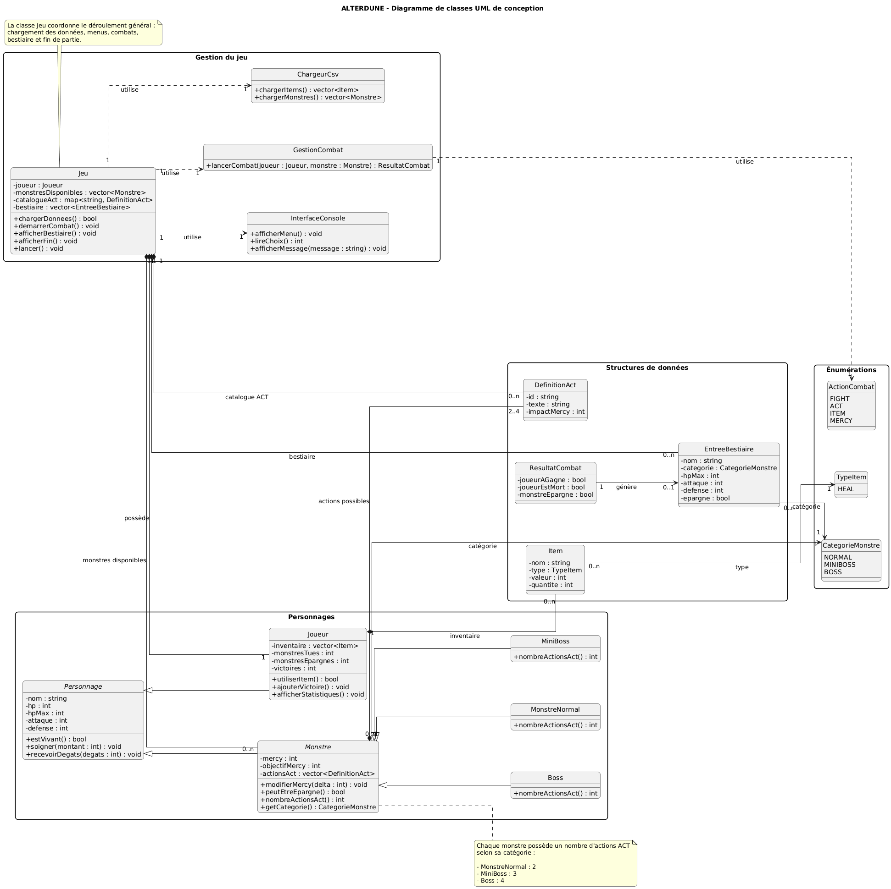

# ALTERDUNE — Mini-RPG console en C++17


## Présentation

**ALTERDUNE** est un mini-jeu RPG en console développé en **C++17** dans le cadre du projet de Programmation Orientée Objet.

Le jeu s’inspire des mécaniques de RPG au tour par tour : le joueur affronte des monstres, peut les combattre directement, interagir avec eux grâce au système **ACT**, utiliser des objets, ou les épargner grâce à la jauge **Mercy**.

L’objectif principal du projet est de mettre en pratique les notions fondamentales de la POO :

- encapsulation ;
- héritage ;
- classe abstraite ;
- classes dérivées ;
- polymorphisme ;
- composition ;
- lecture et validation de fichiers CSV ;
- organisation claire du code en classes.

---

## Fonctionnalités principales

Le projet implémente les fonctionnalités demandées dans le cahier des charges :

- saisie du nom du joueur au lancement ;
- chargement obligatoire de `items.csv` et `monsters.csv` ;
- résumé initial du joueur et de son inventaire ;
- menu principal complet ;
- système de combat au tour par tour ;
- actions `FIGHT`, `ACT`, `ITEM`, `MERCY` ;
- système de Mercy borné entre `0` et `mercyGoal` ;
- catalogue d’actions ACT pré-défini dans le code ;
- monstres répartis en trois catégories :
  - `NORMAL` : 2 actions ACT ;
  - `MINIBOSS` : 3 actions ACT ;
  - `BOSS` : 4 actions ACT ;
- bestiaire des monstres vaincus ;
- statistiques du joueur ;
- inventaire utilisable hors combat et en combat ;
- dégâts aléatoires avec `<random>` ;
- condition de fin à 10 victoires ;
- fins multiples :
  - fin génocidaire ;
  - fin pacifiste ;
  - fin neutre.

---

## Compilation et exécution

### Prérequis

Un compilateur compatible **C++17** est nécessaire.

Exemples :

- `g++`
- `clang++`
- MinGW sous Windows
- WSL sous Windows

---

### Compilation

Depuis le dossier racine du projet :

```bash
g++ -std=c++17 *.cpp -o alterdune
````

---

### Exécution sous Linux / macOS / WSL

```bash
./alterdune
```

---

### Exécution sous Windows

```bash
alterdune.exe
```

Important : le programme doit être lancé depuis le dossier contenant les fichiers :

```txt
items.csv
monsters.csv
```

Sinon, le chargement des données échouera proprement avec un message d’erreur.

---

## Structure du projet

```txt
Alterdune/
│
├── main.cpp
│
├── Character.h
├── Character.cpp
│
├── Player.h
├── Player.cpp
│
├── Monster.h
├── Monster.cpp
│
├── CombatManager.h
├── CombatManager.cpp
│
├── Game.h
├── Game.cpp
│
├── CsvLoader.h
├── CsvLoader.cpp
│
├── ActCatalog.h
├── ActCatalog.cpp
│
├── ActDefinition.h
├── BestiaryEntry.h
├── Item.h
├── UiTheme.h
│
├── items.csv
├── monsters.csv
│
├── uml_alterdune_final.png
├── UML_Alt.png
│
└── README.md
```

---

## Architecture POO

Le projet est organisé autour d’une architecture simple, lisible et adaptée à une soutenance.

### `Character`

Classe de base commune au joueur et aux monstres.

Elle contient les attributs principaux d’un personnage :

* nom ;
* HP actuels ;
* HP maximum ;
* attaque ;
* défense.

Elle fournit aussi les méthodes communes :

* `heal()` ;
* `takeDamage()` ;
* `isAlive()` ;
* accesseurs.

Cette classe permet de factoriser le comportement commun entre `Player` et `Monster`.

---

### `Player`

Classe représentant le joueur.

Elle hérite de `Character` et ajoute :

* l’inventaire ;
* le nombre de monstres tués ;
* le nombre de monstres épargnés ;
* le nombre de victoires ;
* les statistiques du joueur ;
* l’utilisation des items.

L’inventaire est encapsulé dans la classe `Player`, et l’utilisation des objets passe par des méthodes dédiées.

---

### `Monster`

Classe abstraite représentant un monstre générique.

Elle hérite de `Character` et ajoute :

* la jauge `Mercy` ;
* l’objectif `mercyGoal` ;
* la liste des actions ACT disponibles ;
* la méthode `adjustMercy()` ;
* la méthode `canSpare()`.

Elle contient aussi des méthodes virtuelles pures :

```cpp
virtual int actCount() const = 0;
virtual MonsterCategory category() const = 0;
virtual string categoryName() const = 0;
virtual unique_ptr<Monster> clone() const = 0;
```

Cela rend `Monster` abstraite et force chaque type de monstre à définir son comportement spécifique.

---

### Classes dérivées de `Monster`

Trois classes spécialisent `Monster` :

* `NormalMonster`
* `MiniBossMonster`
* `BossMonster`

Elles redéfinissent les méthodes polymorphes afin de déterminer :

* la catégorie du monstre ;
* le nom de la catégorie ;
* le nombre d’actions ACT disponibles ;
* le clonage du monstre avant un combat.

Le polymorphisme est notamment visible dans la méthode `actCount()` :

| Type de monstre   | Nombre d’actions ACT |
| ----------------- | -------------------: |
| `NormalMonster`   |                    2 |
| `MiniBossMonster` |                    3 |
| `BossMonster`     |                    4 |

---

### `Game`

Classe qui coordonne le déroulement global du jeu.

Elle gère :

* le menu principal ;
* le chargement des données ;
* l’affichage du résumé initial ;
* le lancement des combats ;
* le bestiaire ;
* les statistiques ;
* l’inventaire hors combat ;
* les fins multiples.

---

### `CombatManager`

Classe dédiée au système de combat.

Elle gère :

* le tour du joueur ;
* les actions `FIGHT`, `ACT`, `ITEM`, `MERCY` ;
* le tour du monstre ;
* le calcul aléatoire des dégâts ;
* le résultat du combat.

Cette séparation permet de garder la classe `Game` plus lisible.

---

### `CsvLoader`

Classe responsable du chargement des fichiers CSV.

Elle lit et valide :

* `items.csv`
* `monsters.csv`

Elle gère les erreurs minimales demandées :

* fichier introuvable ;
* ligne mal formée ;
* valeurs invalides ;
* actions ACT inconnues.

---

### `ActCatalog`

Classe responsable de la création du catalogue d’actions ACT.

Chaque action contient :

* un identifiant ;
* un texte affiché au joueur ;
* un impact sur la jauge Mercy.

Le catalogue contient plus de 8 actions différentes, dont au moins 2 actions avec un impact négatif sur Mercy.

Exemples d’actions :

* `JOKE`
* `COMPLIMENT`
* `INSULT`
* `DISCUSS`
* `OBSERVE`
* `PET`
* `OFFER_SNACK`
* `REASON`
* `DANCE`
* `THREATEN`

---

## UML

Le diagramme UML final est disponible dans le dépôt.



---

## Fichiers de données

Le jeu charge deux fichiers obligatoires au démarrage.

---

### `items.csv`

Format attendu :

```txt
nom;type;valeur;quantite
```

Exemple :

```txt
Potion;HEAL;15;3
Snack;HEAL;8;5
SuperPotion;HEAL;30;1
```

Rôle des colonnes :

| Colonne    | Description                         |
| ---------- | ----------------------------------- |
| `nom`      | Nom de l’objet                      |
| `type`     | Type de l’objet, limité à `HEAL`    |
| `valeur`   | Nombre de HP soignés                |
| `quantite` | Quantité initiale dans l’inventaire |

---

### `monsters.csv`

Format attendu :

```txt
categorie;nom;hp;atk;def;mercyGoal;act1;act2;act3;act4
```

Exemple :

```txt
NORMAL;Froggit;30;7;1;100;COMPLIMENT;DISCUSS;-;-
MINIBOSS;MimicBox;45;10;2;100;OBSERVE;PET;OFFER_SNACK;-
BOSS;QueenByte;80;15;4;100;REASON;DANCE;JOKE;INSULT
```

Rôle des colonnes :

| Colonne         | Description                              |
| --------------- | ---------------------------------------- |
| `categorie`     | `NORMAL`, `MINIBOSS` ou `BOSS`           |
| `nom`           | Nom du monstre                           |
| `hp`            | Points de vie maximum                    |
| `atk`           | Attaque                                  |
| `def`           | Défense                                  |
| `mercyGoal`     | Seuil à atteindre pour pouvoir épargner  |
| `act1` à `act4` | Identifiants des actions ACT disponibles |

Règles :

* un monstre `NORMAL` utilise seulement `act1` et `act2` ;
* un `MINIBOSS` utilise `act1`, `act2`, `act3` ;
* un `BOSS` utilise les quatre actions ;
* les actions doivent exister dans le catalogue ACT du code ;
* les champs inutilisés peuvent être remplacés par `-`.

---

## Déroulement d’une partie

Au lancement :

1. Le joueur saisit son nom.
2. Le jeu charge `items.csv`.
3. Le jeu charge `monsters.csv`.
4. Un résumé initial est affiché.
5. Le menu principal apparaît.

Menu principal :

```txt
1. Bestiaire
2. Démarrer un combat
3. Statistiques du personnage
4. Items
5. Quitter
```

---

## Système de combat

Chaque combat oppose le joueur à un monstre choisi aléatoirement dans la liste chargée depuis `monsters.csv`.

À chaque tour, le joueur choisit une action :

```txt
FIGHT   ACT   ITEM   MERCY
```

---

### `FIGHT`

Le joueur attaque directement le monstre.

Si les HP du monstre atteignent 0, le monstre est considéré comme tué et le combat est gagné.

---

### `ACT`

Le joueur choisit une action parmi celles disponibles pour le monstre.

Chaque action :

* affiche un texte spécifique ;
* modifie la jauge Mercy ;
* peut augmenter ou diminuer Mercy ;
* respecte un bornage entre `0` et `mercyGoal`.

---

### `ITEM`

Le joueur utilise un objet de son inventaire.

L’objet est consommé et applique son effet, par exemple un soin.

---

### `MERCY`

Le joueur peut épargner le monstre si :

```txt
Mercy >= mercyGoal
```

Dans ce cas, le combat est gagné sans tuer le monstre.

---

## Calcul des dégâts

Les dégâts sont tirés aléatoirement à chaque attaque.

Le tirage respecte le principe demandé dans le cahier des charges :

```txt
dégâts = nombre aléatoire entre 0 et HP max du défenseur
```

Interprétation :

* si les dégâts valent 0, l’attaque rate ;
* sinon, les HP du défenseur diminuent ;
* les HP ne peuvent jamais descendre sous 0 ;
* si les HP atteignent 0, l’entité est vaincue.

L’aléatoire est géré avec la bibliothèque standard `<random>`.

---

## Fins multiples

La partie se termine lorsque le joueur atteint 10 victoires.

La fin dépend des choix du joueur :

| Condition                                           | Fin obtenue     |
| --------------------------------------------------- | --------------- |
| Tous les monstres ont été tués                      | Fin génocidaire |
| Tous les monstres ont été épargnés                  | Fin pacifiste   |
| Certains monstres ont été tués et d’autres épargnés | Fin neutre      |

---

## Tableau de conformité au cahier des charges

| Exigence                                | Implémentation                                   | Statut |
| --------------------------------------- | ------------------------------------------------ | ------ |
| Saisie du nom du joueur                 | Initialisation du joueur au lancement            | ✅      |
| Chargement de `items.csv`               | `CsvLoader::loadItems`                           | ✅      |
| Chargement de `monsters.csv`            | `CsvLoader::loadMonsters`                        | ✅      |
| Résumé initial                          | Affichage du nom, HP et inventaire               | ✅      |
| Menu principal                          | Bestiaire, combat, stats, items, quitter         | ✅      |
| Bestiaire                               | Liste des monstres vaincus avec résultat         | ✅      |
| Statistiques joueur                     | Nom, HP, tués, épargnés, victoires               | ✅      |
| Inventaire                              | Items affichés et utilisables                    | ✅      |
| Combat au tour par tour                 | `CombatManager`                                  | ✅      |
| Actions `FIGHT`, `ACT`, `ITEM`, `MERCY` | Menu de combat complet                           | ✅      |
| Catégories de monstres                  | `NORMAL`, `MINIBOSS`, `BOSS`                     | ✅      |
| Nombre d’ACT selon catégorie            | 2 / 3 / 4 actions                                | ✅      |
| Système Mercy                           | Jauge modifiable et bornée                       | ✅      |
| Catalogue ACT                           | Actions pré-définies dans le code                | ✅      |
| Actions négatives                       | Présence d’actions qui diminuent Mercy           | ✅      |
| Dégâts aléatoires                       | Utilisation de `<random>`                        | ✅      |
| Fin à 10 victoires                      | Condition de fin de partie                       | ✅      |
| Fins multiples                          | Génocidaire, pacifiste, neutre                   | ✅      |
| Gestion fichier introuvable             | Message d’erreur + arrêt propre                  | ✅      |
| Gestion ligne mal formée                | Validation dans le chargement CSV                | ✅      |
| Héritage                                | `Player` et `Monster` héritent de `Character`    | ✅      |
| Classe abstraite                        | `Monster` contient des méthodes virtuelles pures | ✅      |
| Polymorphisme                           | Comportement différent selon les monstres        | ✅      |
| Encapsulation                           | Attributs privés et méthodes d’accès             | ✅      |

---

## Notions de POO démontrées

### Encapsulation

Les attributs importants sont privés et accessibles via des méthodes contrôlées.

Exemples :

* HP du joueur ;
* inventaire ;
* jauge Mercy ;
* statistiques ;
* liste des actions disponibles.

---

### Héritage

`Player` et `Monster` héritent de `Character`.

Cela évite la duplication des attributs communs :

* nom ;
* HP ;
* attaque ;
* défense.

---

### Classe abstraite

`Monster` est une classe abstraite car elle définit des méthodes virtuelles pures.

On ne crée donc pas directement un `Monster`, mais des monstres spécialisés :

* `NormalMonster`
* `MiniBossMonster`
* `BossMonster`

---

### Polymorphisme

Le jeu peut manipuler des monstres via des pointeurs vers `Monster`, tout en appelant le comportement réel de la classe dérivée.

Exemple :

* un `NormalMonster` retourne 2 actions ACT ;
* un `MiniBossMonster` retourne 3 actions ACT ;
* un `BossMonster` retourne 4 actions ACT.

---

### Composition

Le projet utilise la composition à plusieurs endroits :

* `Player` possède un inventaire ;
* `Game` possède un joueur, un catalogue ACT et une liste de monstres ;
* `Monster` possède une liste d’identifiants ACT ;
* le bestiaire contient des entrées de type `BestiaryEntry`.

---

## Tests manuels réalisés

Les cas suivants peuvent être testés pendant la démonstration :

| Test                                                | Résultat attendu                         |
| --------------------------------------------------- | ---------------------------------------- |
| Lancer le jeu avec les CSV présents                 | Le jeu démarre normalement               |
| Supprimer `items.csv`                               | Message d’erreur propre                  |
| Supprimer `monsters.csv`                            | Message d’erreur propre                  |
| Ajouter une ligne mal formée dans `items.csv`       | Erreur ou ligne ignorée selon validation |
| Ajouter une action ACT inconnue dans `monsters.csv` | Erreur de chargement                     |
| Combattre un monstre `NORMAL`                       | 2 actions ACT disponibles                |
| Combattre un `MINIBOSS`                             | 3 actions ACT disponibles                |
| Combattre un `BOSS`                                 | 4 actions ACT disponibles                |
| Utiliser une action ACT positive                    | Mercy augmente                           |
| Utiliser une action ACT négative                    | Mercy diminue                            |
| Mercy dépasse la limite                             | Mercy reste bornée                       |
| Utiliser `MERCY` trop tôt                           | Épargne impossible                       |
| Utiliser `MERCY` à Mercy maximale                   | Monstre épargné                          |
| Tuer un monstre avec `FIGHT`                        | Victoire + monstre tué                   |
| Atteindre 10 victoires avec uniquement des kills    | Fin génocidaire                          |
| Atteindre 10 victoires avec uniquement des épargnes | Fin pacifiste                            |
| Mélanger kills et épargnes                          | Fin neutre                               |

---

## Choix techniques importants

### Pourquoi séparer `Game` et `CombatManager` ?

La classe `Game` gère le déroulement général du jeu, tandis que `CombatManager` gère uniquement la logique de combat.

Cela rend le code plus lisible, plus modulaire et plus facile à expliquer en soutenance.

---

### Pourquoi utiliser `CsvLoader` ?

Le chargement des fichiers est isolé dans une classe dédiée afin de ne pas mélanger :

* la logique du jeu ;
* la lecture de fichiers ;
* la validation des données.

Cela respecte le principe de responsabilité unique.

---

### Pourquoi utiliser une classe abstraite `Monster` ?

Tous les monstres partagent une base commune, mais leur comportement dépend de leur catégorie.

La classe abstraite permet d’imposer une interface commune tout en laissant les classes dérivées personnaliser leur comportement.

---

### Pourquoi utiliser `clone()` ?

Les monstres chargés depuis le fichier servent de modèles.

Lorsqu’un combat commence, le jeu crée une copie du monstre choisi. Cela évite de modifier directement le monstre stocké dans la liste globale.

---

### Pourquoi utiliser `<random>` ?

Le cahier des charges demande un tirage aléatoire des dégâts à chaque attaque.

La bibliothèque `<random>` permet une génération plus propre et moderne que `rand()`.

---

## Questions possibles en soutenance

### Où voit-on l’héritage ?

On le voit avec `Character`, qui sert de classe de base pour `Player` et `Monster`.

---

### Où voit-on le polymorphisme ?

On le voit avec les méthodes virtuelles de `Monster`, redéfinies dans `NormalMonster`, `MiniBossMonster` et `BossMonster`.

Par exemple, `actCount()` retourne un nombre différent selon le type réel du monstre.

---

### Pourquoi `Monster` est une classe abstraite ?

Parce qu’un monstre générique n’a pas de catégorie précise. On veut obliger chaque type de monstre à définir son comportement.

---

### Comment fonctionne Mercy ?

Chaque action ACT modifie la jauge Mercy.
Si Mercy atteint `mercyGoal`, le joueur peut utiliser `MERCY` pour épargner le monstre.

---

### Comment les fichiers CSV sont-ils utilisés ?

`items.csv` initialise l’inventaire du joueur.
`monsters.csv` initialise la liste des ennemis possibles.

---

### Pourquoi les actions ACT ne sont-elles pas entièrement dans le CSV ?

Le CSV indique seulement les identifiants d’actions disponibles pour chaque monstre.

Le texte et l’impact sur Mercy sont définis dans le catalogue ACT du code, ce qui centralise la logique des actions.

---

### Comment est déterminée la fin de partie ?

La partie se termine à 10 victoires.

Ensuite, le programme compare le nombre de monstres tués et épargnés :

* uniquement tués : fin génocidaire ;
* uniquement épargnés : fin pacifiste ;
* mélange des deux : fin neutre.

---

## Auteurs

Projet réalisé dans le cadre du cours de Programmation Orientée Objet en C++.

**Étudiant :** Cyril Ibrahim / Baptiste Leroy
**École :** ESILV
**Année :** 2025-2026

---

## Conclusion

ALTERDUNE respecte les objectifs du projet de POO en C++ : il propose une architecture orientée objet claire, des classes spécialisées, une classe abstraite, du polymorphisme, une gestion de fichiers CSV, un système de combat complet et des fins multiples.

Le projet est conçu pour être compréhensible, défendable en soutenance et facilement extensible.
